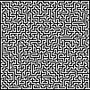

# Maze Solver
Application for solving maze pictures using the A* algorithm discussed [in this other project of mine](https://github.com/aurasphere/reply-challenge-2018).

It doesn't work for large pictures since it reads images pixel-by-pixel, without clustering.

For sample usage, check the jUnit. You can use [this website](https://keesiemeijer.github.io/maze-generator/#generate) to generate mazes. Remember to set the wall thickness to 1 and to match the maze color with `MazeSolver.wallColor`.

| Before  | After |
| ------------- | ------------- |
|   |   |
|   |   |
|   |   |
|   |   |
|   |   |
 

Copyright (c) 2018 Donato Rimenti
